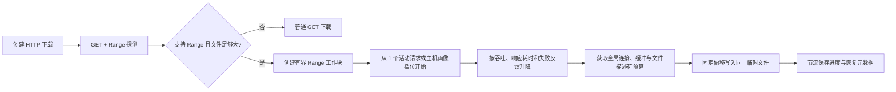
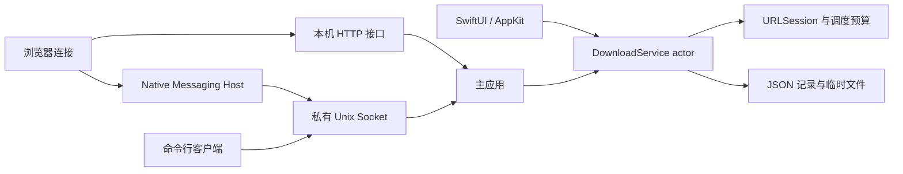

<p align="center">
  
</p>

<h1 align="center">酷的下载管理器</h1>

<p align="center">
  使用 Swift 构建的原生 macOS 下载管理器，在下载速度、资源占用和恢复可靠性之间保持可观测、可验证的平衡。
</p>

<p align="center">
  
  
  
</p>

> [!IMPORTANT]
> 当前仓库提供开发构建和本地打包能力，尚未提供经过 Developer ID 签名与 Apple 公证的正式安装包。

## 目录

- [核心能力](#核心能力)
- [性能设计](#性能设计)
- [快速开始](#快速开始)
- [使用说明](#使用说明)
- [架构](#架构)
- [开发与验证](#开发与验证)
- [打包 macOS 应用](#打包-macos-应用)
- [文档](#文档)
- [当前边界](#当前边界)

## 项目简介

酷的下载管理器是一款面向 macOS 的原生下载工具。应用界面使用 SwiftUI 与 AppKit，HTTP、HLS、调度、限速、恢复和持久化均由纯 Swift 下载核心完成，不依赖外部下载引擎。

项目不仅关注峰值速度，也关注多任务公平、内存背压、文件描述符占用、失败重试和崩溃恢复。HTTP Range 下载采用自适应并发：先以较低并发建立基线，只有观测到实际收益时才增加请求，不会因为设置了较高上限就固定打满连接。

## 核心能力

### 下载协议

- HTTP 与 HTTPS 下载，支持暂停、继续、取消、重试和断点恢复。
- HTTP Range 探测、并行字节范围下载及 `ETag`、`Last-Modified`、`Content-Range` 完整性校验。
- 对签名下载地址使用 `GET + Range: bytes=0-0` 探测，避免仅因 `HEAD` 不被签名策略允许而误判失败。
- HLS 主播放列表与媒体播放列表下载，自动选择最高带宽变体并按顺序组装未加密分片。
- 自定义请求头、客户端标识、系统代理、直连、手动 HTTP/HTTPS 代理与 PAC。

### 任务管理

- 新建下载、批量地址展开、搜索、排序、多选操作和重新下载。
- 下载分类、下载队列、队列并发、定时启动/停止和完成事件。
- 全局、单任务和单主机的最大连接数与速度限制。
- 文件摘要计算与校验、服务器文件名识别、重复文件自动重命名。
- 稀疏文件预分配、可选未完成文件后缀和服务器修改时间保留。

### macOS 体验

- 原生分栏界面、菜单栏入口、完成通知、进度窗口和下载详情。
- 进度窗口显示“当前活动请求数 / 设置上限”、Range 工作块状态和各工作块速度。
- 支持跟随系统、浅色与深色主题，提供界面缩放和单位设置。
- 支持登录时启动、浏览器 Native Messaging、仅本机监听的 HTTP 接口和命令行控制。

## 性能设计

### 分片下载的基本原则

分片下载并不必然更快。只有当单个请求受到服务端、链路、代理或拥塞窗口限制，而总带宽仍有余量时，并发 Range 请求才可能提高吞吐。单连接已经跑满链路时，增加请求通常只会增加 TLS/HTTP 处理、缓冲、文件描述符、乱序写入和服务端压力。

当前调度流程如下：



### 连接数与工作块

这三个数字含义不同：

| 概念 | 含义 |
| --- | --- |
| 单任务最大连接数 | 用户设置的单任务 HTTP 请求上限；新安装默认为 `8`，可配置范围为 `1...64` |
| 当前连接数 | 此刻正在传输数据的 HTTP 请求数；HTTP/2 下多个请求可能复用同一条 TCP 连接 |
| Range 工作块 | 持久化的字节范围任务，不等于线程或连接；下载执行器完成一个工作块后可继续领取下一个 |

自动任务通常从 `1` 个活动请求开始，按 `1 / 2 / 4 / 8` 风格逐级试探。新任务最多创建“连接上限的 4 倍”且不超过 `128` 个工作块，因此看到 `32` 个工作块并不表示同时建立了 `32` 个连接。

任务显式设置优先于主机设置，主机设置优先于全局设置。主机性能画像只决定自动任务的初始档位，不能突破用户设置的上限，也不会永久阻止后续试探。

### 资源预算与背压

| 机制 | 当前策略 | 作用 |
| --- | --- | --- |
| 最小 Range 工作块 | `16 MiB` | 文件无法形成至少两个工作块时直接使用普通 GET |
| 全局 Range 请求预算 | `16` 个许可 | 限制所有任务合计的实际 Range 请求，按任务轮转分配 |
| 响应缓冲 | 单请求约 `1 MiB` 高水位，全局 `16 MiB` 预算 | 消费者写盘变慢时暂停网络读取，避免内存无界增长 |
| 文件描述符预算 | 默认 `128` 个预留单位 | 同时约束临时文件和 HTTP 请求，等待预算时不建立网络连接 |
| 重试预算 | 默认 `2` 个并发重试槽位 | 防止多个失败任务形成重试风暴；退避等待不占槽位 |
| 速度限制 | 全局聚合限制，再叠加任务或主机限制 | 增加分片不会复制限速额度，局部设置只能进一步收紧 |
| 进度事件 | 最快约每 `250 ms` 合并一次 | 避免高速下载持续刷新界面 |
| 持久化检查点 | 最长约 `2 s` 或新增约 `64 MiB`，状态变化时强制保存 | 降低 JSON 编码、同步写入和原子替换对吞吐的干扰 |
| 主机性能画像 | 默认保留 `7` 天，最多 `256` 条 | 复用主机级吞吐经验，不保存 URL 路径、查询参数或凭据 |

Range 请求使用明确的文件偏移直接写入同一个临时文件，不需要下载完成后再拼接多个分片文件。现代下载记录会把工作块元数据内嵌到记录中；记录通过同目录临时文件和原子替换保存，进程异常退出后会把失去运行任务的下载恢复为可继续的暂停状态。

### 基准结论

仓库内的 `CoolDownloadBenchmark` 直接调用生产下载核心，在独立子进程中运行可控 HTTP/1.1 Range 服务或外部 HTTP(S) 地址，并校验最终文件。正式矩阵覆盖系统 APFS、外置 USB APFS SSD、HTTP/1.1、HTTP/2、直连、代理、低文件描述符、503 重试、总带宽限制和进程中止恢复。

| 场景 | 测量结果 | 结论 |
| --- | --- | --- |
| 系统 APFS，256 MiB 本机源 | 1/2/4/8/16 上限的中位吞吐为 `3655/2211/2153/2122/2092 MiB/s` | 单请求已跑满本机路径，多请求反而增加开销 |
| 每请求约 4 MiB/s 的受限源 | 1/2/4/8/16 上限的中位吞吐为 `3.80/6.22/7.80/7.73/7.79 MiB/s` | 并发有条件提速，但收益在 4 个请求附近平台化 |
| 总带宽固定为 16 MiB/s | 各档位中位吞吐均为 `15.86-15.95 MiB/s` | 总带宽已满时增加请求没有收益 |
| 16 MiB 与 32 MiB 最小工作块 | 相同受限负载下为 `11.94` 与 `7.45 MiB/s` | 当前保留 16 MiB 阈值 |
| 4 个任务共享 8 与 16 个 Range 许可 | 中位吞吐差约 `1.8%`，16 个许可使用更多服务端并发与文件描述符 | 16 是跨任务安全上限和余量，不是目标并发 |

这些结果只代表报告记录的机器、存储和网络条件，不代表所有服务器都能达到同样速度。USB HDD 与 NAS/NFS 尚无可写测试环境，因此没有用 APFS 数据代替这两类结论。完整方法、原始数据和限制见[下载核心性能评估](docs/download-core-performance-evaluation.md)与[基准工具说明](Benchmarks/README.md)。

## 快速开始

### 环境要求

- macOS 13 或更高版本。
- Swift 6 工具链；建议使用完整 Xcode。
- 仅在生成 DMG 时需要 Homebrew 的 `create-dmg`。

### 使用 Xcode 运行

在仓库根目录打开 Swift Package：

```sh
open Package.swift
```

选择 `CoolDownloadManager` Scheme 运行应用。Xcode 直接读取 `Package.swift`，仓库不提交生成的 `.xcodeproj`。

### 使用命令行运行

```sh
swift build --disable-sandbox
swift run --disable-sandbox CoolDownloadManager
```

默认数据目录为 `~/.cooldm`，默认下载目录为 `~/Downloads/CoolDM`，未完成文件使用 `.cooldm.part` 后缀。

## 使用说明

1. 点击主窗口中的“新建下载”，输入 HTTP、HTTPS 或 HLS 地址。
2. 可选择保存目录、分类、队列以及是否立即开始。
3. 在下载详情中设置任务级最大连接数或限速；留空时依次继承主机设置和全局设置。
4. 打开下载进度窗口查看实际活动请求数、设置上限、工作块进度与实时速度。
5. 在“设置 > 下载”中调整全局连接上限、并发任务数、总速度限制与文件策略。

本机 HTTP 接口默认监听 `127.0.0.1:15151`，可在设置中关闭、修改端口或启用访问密钥。接口定义见 [REST-API.yml](REST-API.yml)。

应用运行后，可使用命令行客户端执行连通性检查或添加任务：

```sh
swift run --disable-sandbox CoolDownloadManagerCLI ping
swift run --disable-sandbox CoolDownloadManagerCLI add https://example.com/file.zip
```

以下环境变量仅用于开发和集成检查：

```sh
CDM_MAX_CONCURRENT_DOWNLOADS=3
CDM_RANGE_CONNECTIONS=8
CDM_NATIVE_HOST_PATH=/path/to/CoolDownloadManagerNativeMessagingHost
```

## 架构



| 模块 | 职责 |
| --- | --- |
| `CoolDownloadCore` | HTTP/HLS、Range 调度、限速、重试、校验、持久化与恢复 |
| `CoolDownloadIntegration` | 本机 HTTP 接口、Native Messaging、Unix Socket 与浏览器清单安装 |
| `CoolDownloadManager` | SwiftUI/AppKit 主应用及 macOS 系统集成 |
| `CoolDownloadManagerNativeMessagingHost` | 浏览器标准输入输出与主应用私有 Socket 之间的轻量转发 |
| `CoolDownloadManagerCLI` | 面向开发检查的命令行客户端 |
| `CoolDownloadBenchmark` | 使用生产下载核心执行可重复性能矩阵并输出结构化报告 |

主应用是下载状态的唯一写入者。浏览器宿主和命令行客户端不包含下载逻辑，只负责把请求转交给正在运行的主应用。

## 开发与验证

从仓库根目录运行项目定义的验证命令：

```sh
swift test --filter CoolDownloadManagerTests --disable-sandbox
swift test --filter CoolDownloadCoreTests --disable-sandbox
swift test --filter CoolDownloadIntegrationTests --disable-sandbox
swift build --disable-sandbox
```

运行本机 Range 性能矩阵：

```sh
swift run --disable-sandbox CoolDownloadBenchmark \
  --size-mib 256 \
  --connections 1,2,4,8 \
  --repetitions 3 \
  --warmups 1 \
  --minimum-part-mib 16 \
  --output /tmp/cooldm-benchmark.json
```

基准进度写入标准错误，带版本号的 JSON 报告写入指定文件；每次测量都会校验完成文件。更多受限源、代理、外部存储、低 FD、重试压力和进程恢复参数见 [Benchmarks/README.md](Benchmarks/README.md)。

## 打包 macOS 应用

生成本地 `.app`、ZIP 与拖拽安装 DMG：

```sh
brew install create-dmg
./scripts/package-macos.sh --dmg --zip
```

产物输出到 `dist/`。脚本默认生成临时（ad-hoc）签名的本地开发包；用于分发时应提供 Developer ID，并在构建后完成 Apple 公证：

```sh
./scripts/package-macos.sh \
  --signing-identity "Developer ID Application: 你的名称 (TEAMID)" \
  --dmg --zip
```

## 文档

- [下载调度概念与处理流程](docs/download-scheduling-concepts.md)：解释任务并发、连接上限、工作块和大小文件决策。
- [下载核心性能评估](docs/download-core-performance-evaluation.md)：记录性能假设、实现依据、完整矩阵和证据边界。
- [性能基准工具](Benchmarks/README.md)：说明本机夹具、外部源、代理、存储和恢复测试参数。
- [macOS 开发与打包](macos/README.md)：记录 Scheme、应用包、DMG 与浏览器集成细节。
- [本机 HTTP 接口](REST-API.yml)：OpenAPI 3.0 接口定义。

## 当前边界

- HLS 暂不支持加密播放列表和 `EXT-X-BYTERANGE` 媒体分片。
- 队列完成后的关机、睡眠、休眠和锁屏动作只会提示用户确认，不会直接执行系统命令。
- 正式 Developer ID 签名、Apple 公证、自动更新和已安装浏览器的完整验收尚未完成。
- USB HDD、NAS 与 NFS 下载性能尚未形成有效基准证据。

## 参与贡献

提交问题或代码前请阅读 [CONTRIBUTING.md](CONTRIBUTING.md)。性能改动应附带可复现负载、对照组、输出完整性校验以及 CPU、内存、文件描述符或写盘指标，不能只用“连接更多”作为提速依据。

## 许可证

项目基于 [Apache License 2.0](LICENSE) 发布。
